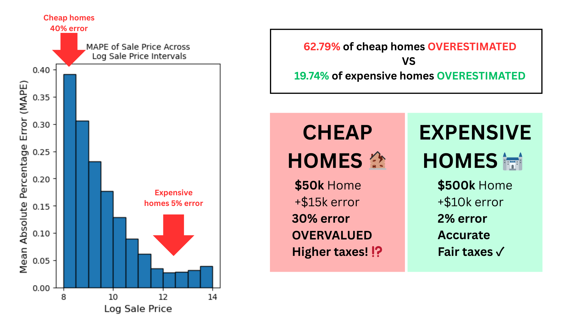

# Cook County Housing Fairness Study (UC Berkeley Data 100 — Projects A1 & A2)

This repo documents my personal take on the UC Berkeley Data 100 Projects A1 and A2. The work examines Cook County (Chicago) housing assessments through the lens of fairness: why lower-valued homes were often over-assessed while high-priced properties were under-assessed, and what "fair" modeling could look like when real people and taxes are on the line.

## Key Findings

*Mean Absolute Percentage Error analysis revealing disproportionate assessment errors across price ranges*

*Residual patterns demonstrating systematic bias in housing assessments*

## What I explored
- Dug into the Cook County training data to understand distributions, spot outliers (like the spike at \$1 sales), and justify filtering rules.
- Engineered features such as total bathrooms, neighborhood indicators, wall material encodings, and log-transformed targets to stabilize the modeling problem.
- Built linear regression baselines and evaluated them with train/validation splits and k-fold cross-validation, focusing on both accuracy and behavior across price segments.
- Compared error metrics (RMSE vs. percentage-style custom metrics) to reveal who gets over- or under-valued; residual plots surfaced that inexpensive homes bore larger proportional errors.
- Reflected on fairness: how model choices affect real tax burdens, what “regressive” errors look like, and how alternate metrics can highlight inequity that aggregate accuracy can hide.

## Techniques and tools
- Exploratory data analysis with pandas/seaborn/matplotlib (distributions, outlier checks, interval-based summaries).
- Feature engineering and one-hot encoding for categorical signals tied to neighborhoods and construction details.
- Linear models with scikit-learn, cross-validation for generalization checks, and custom error metrics to emphasize proportional fairness.
- Interval-based diagnostics (RMSE by log-price bucket, proportion of overestimates) to see who benefits or is harmed by the model.

## Why it matters
Our analysis revealed a stark disparity: the model overestimated cheap homes 62.79% of the time, but expensive homes only 19.74% of the time. This regressive error pattern directly harms working-class homeowners who disproportionately own lower-priced properties in non-white neighborhoods, forcing them to pay higher effective tax rates despite no explicit racial variable in the model. This reflects the real lawsuit against Cook County Assessor's office for producing racially discriminatory assessments.
